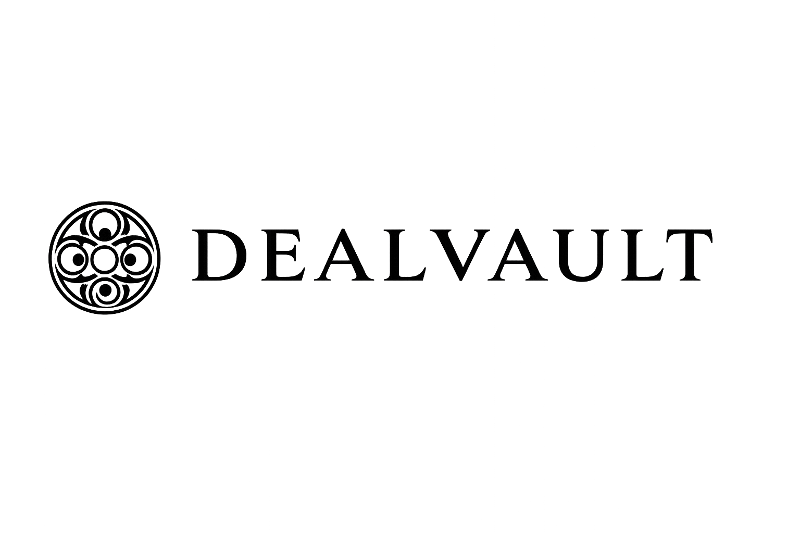

<div align="center">
  
  <br/>
  <br />
  
  <h1>DealVault</h1>
  <p><b>The Open Escrow Standard for Stellar.</b></p>
  
  <p>
    Fund bounties in USDC, contributors get paid automatically by Soroban smart contracts.
  </p>

  <p>
    <a href="https://github.com/your-org/dealvault-platform-escrow/actions"></a>
    <a href="https://opensource.org/licenses/MIT"></a>
    <a href="https://discord.gg/yourdiscord"></a>
  </p>
</div>

<br />

## 🌟 Why DealVault?

Freelancers and open-source contributors shouldn't have to trust clients to pay net-30. With DealVault, project owners lock **USDC** directly into a **Soroban Smart Contract** on the Stellar network before work begins. 

Once the work is approved, the funds are instantly released. **Zero trust required. 100% on-chain.**

- **🛡️ KYC Verified** – Trust but verify all parties involved.
- **⚡ Instant Settlement** – No wire transfers, no 3-day wait times.
- **🌍 180+ Countries** – Global by default.
- **⛓️ 100% On-Chain** – Fully auditable smart contracts.

---

## 🛠️ Compatible Stack

Works effortlessly with your favorite tools and networks:

| Wallets | Assets | Frameworks |
| :--- | :--- | :--- |
| **Freighter** | **USDC** | **React** |
| **Lobstr** | **XLM** | **Node.js** |
| **xBull** | **USDT** | **Express** |
| **Solar** | **Any Stellar Asset** | **MongoDB** |
| **Any Stellar Wallet** | | **Soroban** |

---

## 🚀 Getting Started

### Prerequisites
- Node.js ≥ 20
- MongoDB (local or Atlas)
- Docker (optional for full-stack deployment)

### Local Development

1. **Start the Backend**
   ```bash
   cd backend
   cp .env.example .env    # Edit with your JWT secrets and DB URI
   npm install
   npm run dev             # Server running on http://localhost:5000
   ```

2. **Start the Frontend**
   ```bash
   cd frontend
   npm install
   npm run dev             # Vite dev server on http://localhost:5174
   ```

### Docker (Full Stack)

Spin up the entire application (Frontend, Backend, and MongoDB) with a single command:
```bash
cd docker
docker compose up --build
```

---

## 🏗️ Project Architecture

```plaintext
dealvault-platform-escrow/
├── backend/                    # Node.js + Express REST API
│   ├── controllers/            # Route business logic
│   ├── models/                 # Mongoose schemas
│   ├── routes/                 # API endpoints
│   └── tests/                  # Jest integration tests
│
├── frontend/                   # React + TypeScript + Vite UI
│   ├── src/
│   │   ├── components/         # Reusable UI elements
│   │   ├── images/             # Static assets
│   │   └── App.tsx             # Main application view
│
├── contracts/
│   └── soroban/                # Rust on-chain escrow program (Stellar)
│
└── docker/                     # Dockerfiles & docker-compose.yml
```

---

## 🔗 Smart Contract (Soroban)

The on-chain escrow program handles trustless fund locking on the Stellar network.

```bash
# Deploy the contract
$ stellar contract deploy --wasm escrow.wasm
```

**Core Instructions:**
- `init_escrow` — Lock buyer funds in the contract.
- `release` — Transfer funds securely to the seller.
- `refund` — Return funds to the buyer if conditions aren't met.
- `dispute` — Flag for decentralized arbitration.

---

## 🧪 Testing

```bash
cd backend
npm test                  # Run all integration tests
npm run test:coverage     # Generate coverage report
```

---

## 📄 License

MIT © DealVault Contributors
